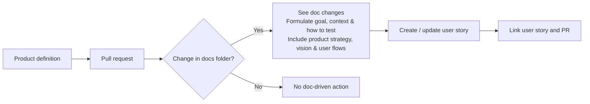

# doc-driven-dev
A project to test the following concept: 

# Product Vision
# Product Vision Canvas

| Section | Description |
|--------|-------------|
| **Vision** | Create an automated, documentation-driven development assistant that keeps product definition, user flows, strategy, and implementation seamlessly aligned. |
| **Target Group** | Software product teams: Product Managers, Designers, Developers, Tech Leads, QA Engineers. |
| **Needs / Problems** | - Disconnect between product definitions and actual development work. - Documentation is often outdated or neglected. - User stories are created separately from the product definition and PRs, causing inconsistencies. - Difficult to maintain a continuous connection between product strategy, vision, user flows, and implementation. - Manual translation from product definition to development work wastes time and introduces misalignment. |
| **Product** | A system that monitors documentation and pull requests, detects changes, interprets their intent, generates user stories with goal/context/test guidance, and links them to PRs—ensuring documentation-driven, strategy-aligned development. |
| **Business Goals** | - Reduce time spent writing and maintaining user stories. - Improve quality, completeness, and accuracy of documentation. - Strengthen alignment between product strategy and implementation decisions. - Reduce rework and misunderstandings caused by unclear requirements. - Promote documentation-first and consistent product thinking. - Increase developer efficiency and clarity. |
| **Key Features** | - Automatic detection of documentation changes from PRs. - Extraction of goals, context, assumptions, and test ideas. - Integration with product strategy & user flows. - Automated creation or enrichment of user stories. - Linking PRs and stories for traceability. - Optional doc-driven validation or test hints. |
| **Value Proposition** | Ensure that product changes always reflect strategic intent and user needs by automatically translating documentation updates into actionable, high-quality user stories. |
| **Differentiators** | - Deep integration with the development workflow (PRs + docs). - AI-assisted extraction of product intent from real documentation. - Strong focus on product strategy and user flows, not just text summarization. - Encourages healthy documentation habits without extra burden. - Unique “doc-driven dev” workflow innovation. |
| **Metrics** | - Time saved per story created. - Documentation update frequency. - Reduction in rework due to unclear requirements. - Consistency score between docs, stories, and PRs. - Adoption across teams (active users / repos). |

# User flows

# Features

- A product repo contains the product definition (Strategy, vision, user flows, desired behaviour, how to test...).
- After a change in the product description a pull request and connected issue will be created. 

