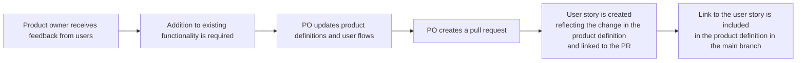
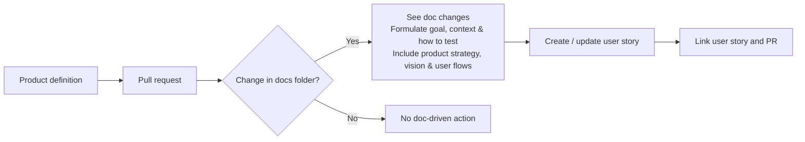

# doc-driven-dev
A project to test the following concept: 

# Product Vision

| **Product Vision** |
|--------------------|
| We create room for teams to focus on exceptional product creation by ensuring that every story naturally reflects the strategy, vision and user flows. We achieve this by taking away the manual effort of connecting documentation to development and by generating meaningful, well-aligned stories. |

| **Target Groups** | **Needs** | **Product** | **Business Goals** |
|-------------------|-------------------|-------------------|-------------------|
| Software product teams (PMs, Designers, Developers, Tech Leads, QA). | - Disconnect between product definition and development work. - Documentation is outdated or neglected. - Story creation is detached from definitions and PRs. - Hard to maintain alignment between strategy, vision, user flows, and implementation. | - Automatic detection of documentation changes from PRs. - Extraction of goals, context, assumptions, and test ideas. - Integration with product strategy & user flows. - Automated creation or enrichment of user stories. - Linking PRs and stories for traceability. - Optional doc-driven validation or test hints. | - Reduce time spent creating/maintaining user stories. - Improve documentation quality and consistency. - Strengthen alignment between strategy and implementation. - Reduce rework caused by unclear requirements. - Increase team productivity and clarity. |

| **Differentiators** | **Metrics**|
|--------|-------------|
| - Deep integration with the development workflow (PRs + docs). - AI-assisted extraction of product intent from real documentation. - Strong focus on product strategy and user flows, not just text summarization. - Encourages healthy documentation habits without extra burden. - Unique “doc-driven dev” workflow innovation. | - Time saved per story created. - Documentation update frequency. - Reduction in rework due to unclear requirements. - Consistency score between docs, stories, and PRs. - Adoption across teams (active users / repos). |

# User flows

# Features

- A product repo contains the product definition (Strategy, vision, user flows, desired behaviour, how to test...).
- After a change in the product description a pull request and connected issue will be created. 

